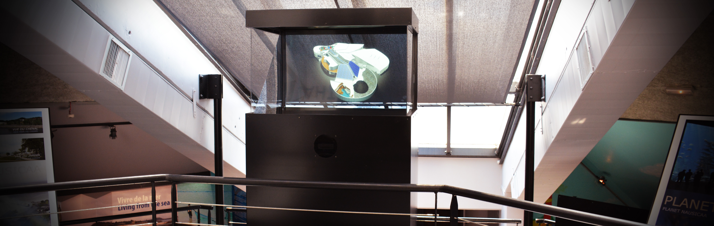

# Nausicaa : Holographic building model

  

    

      Stingray has been used to produce photographic-like rendering on Nausicaa's new building, currently under construction. The goal was to involve visitors in the construction process of Nausicaa's extension.
    

    
We used a tailor-made <a href="https://sdumetz.github.io/2016/08/15/capacitive-wheel.html">capacitive wheel</a> to provide users with an easy to use rotation controller.
    

    

      As interactive 3D models are becoming more prevalent in the building industry, we believe there is a need to show previews of architectural projects. Stingray can help here by providing 3D interactions while still using the tools infographists know and love
    

  

  

    
  

# More Use cases to come.

have you done something with Stingray? [Let us Know!](https://github.com/holusion/stingray/issues) We will happily feature you here.
